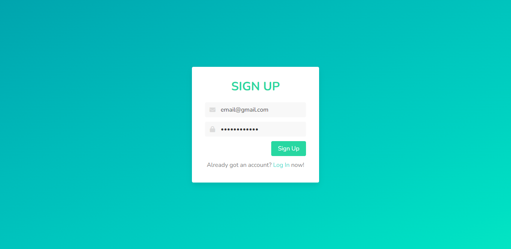
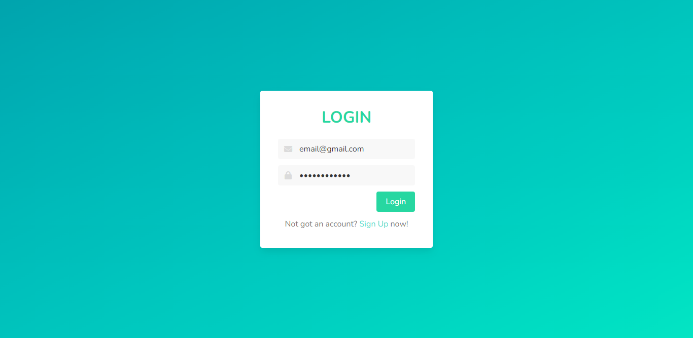
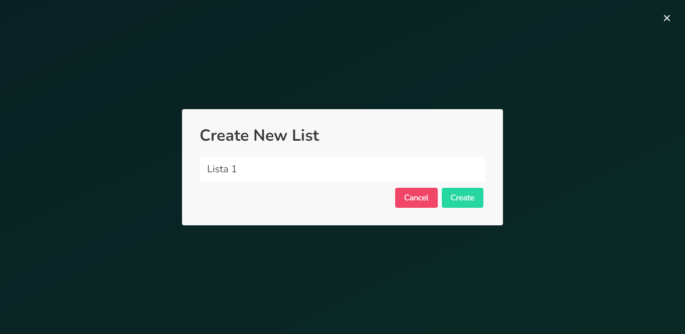
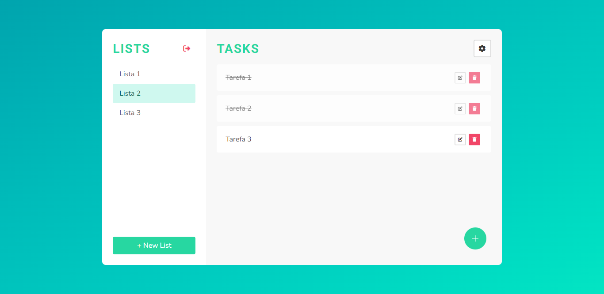

# Task Manager

Projeto FullStack feito com o intuito de aprendizado, utilizando a stack MEAN (MongoDB, Express, Angular e Node).

## Overview

Os usuários devem ser capazes de:

- Criar uma conta e fazer login/logout
- Criar, editar e remover listas
- Criar, completar, editar e remover tarefas

### Screenshots

 - Tela de cadastro

 - Tela de login

 - Tela de criação de lista

 - Tela principal

## Tecnologias

### Feito com

- Angular 14
- Node
- MongoDB
- ExpressJs
- Bulma CSS

## Author

- GitHub - [Philipe Mello](https://github.com/Philipessj1)

